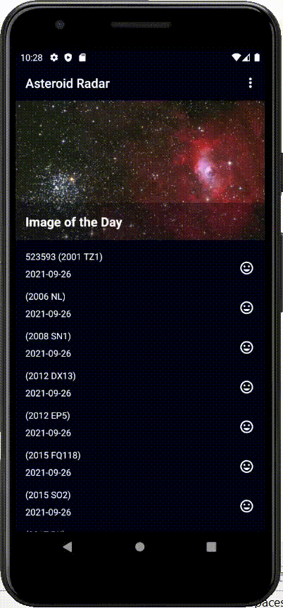

# Udacity-Asteroid-Radar-App

### Udacity course 2 completion project

  

#### • Layouts using the ViewGroups and Views
#### • Databinding in Layouts
#### • < data > and < variable > elements within the layout
#### • ScrollView and LinearLayout for showing a list of items
#### • Navigation file that takes a user from one page to the next
#### • Databinding for click listeners on a navigation screen
#### • The asteroids displayed in the screens were downloaded from the NASA API
#### • The app can save the downloaded asteroids in the database and then display them also from the database
